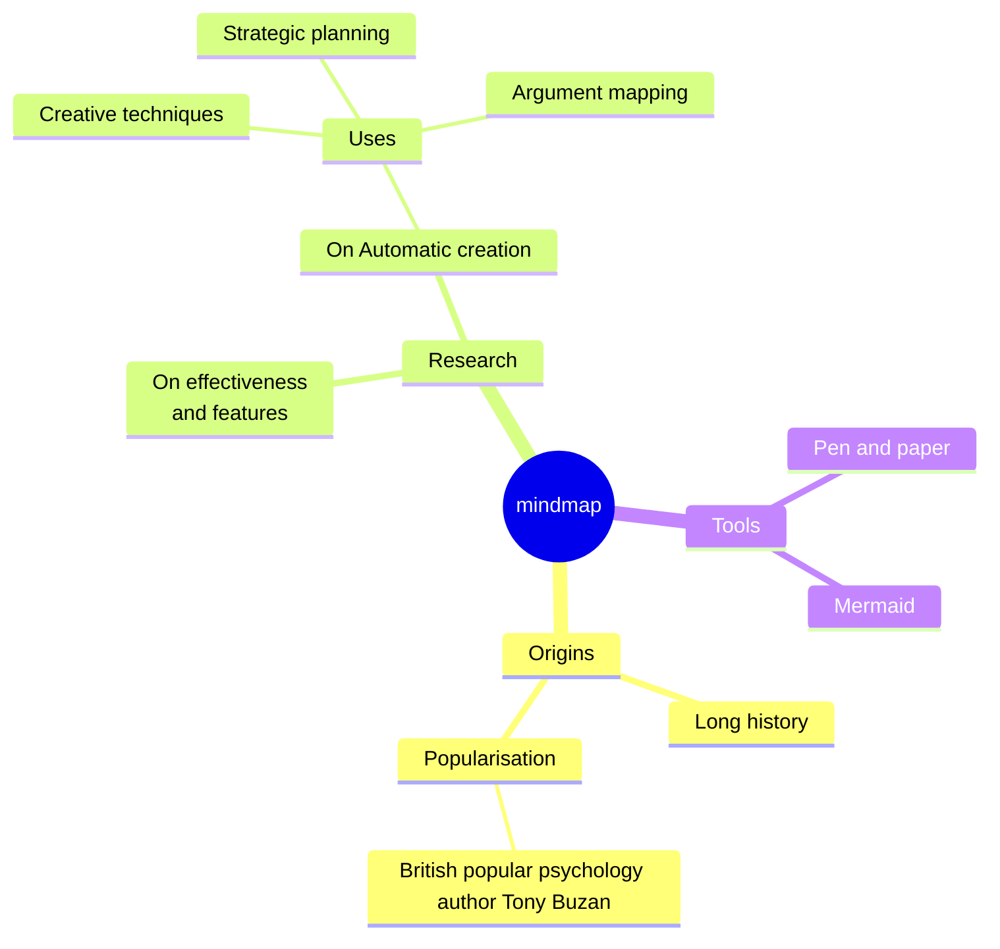

# ✍️ Notebook

Made With [mdbook](https://github.com/rust-lang/mdBook)

## 🧬 Sync Affine Note with app 

Update Remote 
- for each markdown you have updated, in affine pro export to markdown
- affine pro will output some zip file
- then you can unzip that to folder with same name (use camelCase for convention)
- done

Update Local 
- you can use import feature in affine pro
