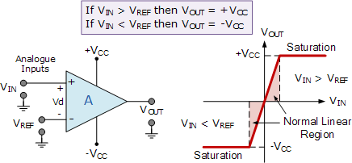
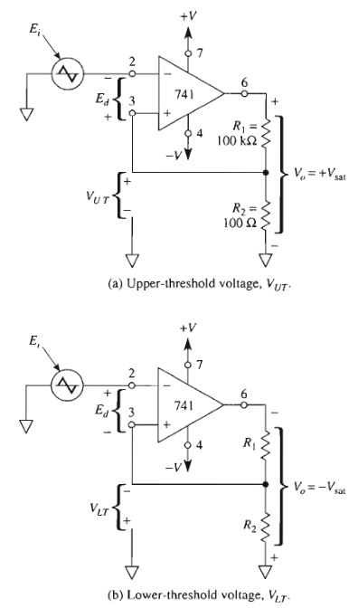
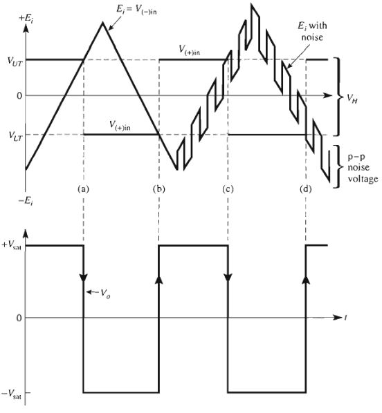
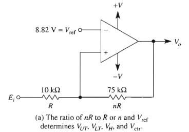

# Comparator [Frederick]
komparator adalah device yang membandingkan(compare) dua buah tegangan atau arus, output dari komparator akan 
mengindikasikan input mana yang lebih besar. 

## komparator sederhana / voltage level detector

| *Fuck Yeah* |

komparator dapat dirangkai menggunakan opamp, input negatif dan positif opamp diberi 2 buah tengangan yang berbeda.
ketika input tegangan positif lebih besar dari input tengangan negatif, output komparator akan akan sama dengan VCC 
atau tegangan supply positif dari opamp, dan jika input tegangan positif lebih kecil dari input tegangan negatif, 
maka output komparator akan sama dengan -VCC atau supply negatif dari opamp.

secara sederhana kompartor dengan konfigurasi seperti gambar diatas dapat dituliskan sebagai berikut (ingat terniary operator)

$$
  V_{OUT} = V_{IN} > V_{REF} \\: ? \\: +V_{CC} : -V_{CC} 
$$

## zero crossing comparator

| *Fuck Yeah* |

comparator jenis ini memiliki titik tengah di tegangan referensi (gnd). dengan nilai histerisis dapat dihitung dengan 
persamaan dibawah ini(histerisis adalah standard untuk menunjukan performa dari komparator).

$$
  V_H = V_{UT} - V_{LT} \\
  V_{UT} = \frac{R2}{R1 + R2} (+V_{SAT})\\
  V_{LT} = \frac{R2}{R1 + R2} (-V_{SAT})
$$

dimana:   
\\(V_H\\) = tegangan histerisi  
\\(V_{LT}\\) = Low Threshold Voltage  
\\(V_{UT}\\)= Upper Threshold Voltage 

**penalaran:** jika komparator dengan tegangan supply \\(+- 5V\\), dan \\(R1=R2=1K\\). ketika \\(E1 < 2.5V\\)soutput
\\(V_{OUT}\\) = \\(+V_{SAT}\\), namun jika \\(E1 > 2.5V\\) output akan switch menjadi \\(V_{OUT}\\) = \\(-V_{SAT}\\), \\(V_{OUT}\\) akan kembali 
ke \\(+V_{SAT}\\) ketika \\(E1 < -2.5V\\). \\(+2.5V\\) dan \\(-2.5V\\) disebut \\(V_{UT}\\) dan \\(V_{LT}\\) (hal ini terjadi jika komparatornya inverting).

| *Fuck Yeah* |

## Voltage level detector with histerisis

terkadang tegangan tengah yang diinginkan saat melakukan komparasi tidaklah 0V, melainkan nilai tegangan melebihi 0V.
rangkaian komparator yang telah diberikan pada gambar diatas memiliki tegangan tengah di 0V, namun dengan memberikan 
offset tegangan baik pada positif feedback maupun pada kaki negatif, dapat memberikan offset pada tegangan tengah 
sesuai dengan keinginan.

terdapat 2 buah jenis **voltage level detector with hysterisis** yaitu non-inverting dan inverting 
voltage level detector with hysiterisis.

### Non inverting voltage detector with hysterisis

| *Fuck Yeah* |

rasio \\(nR, R\\) menentukan nilai \\(V_{UT}, V_{LT}, V_{CTR}\\), untuk menurunkan rumus gunakan _nodal analysis_. rumus akhir adalah sebagai berikut.

$$
  V_{UT} = V_{Ref}(1 + \frac{1}{n}) - \frac{-V_{SAT}}{n}\\
  V_{LT} = V_{Ref}(1 + \frac{1}{n}) - \frac{+V_{SAT}}{n}\\
  V_{CTR}= \frac{V_{UT} + V_{LT}}{2} = V_{ref}(1 + \frac{1}{n})
$$

untuk menuruntkan rumus $V_{UT}, V_{LT}$ dapat digunakan nodal analysis dan mensamadengankan 0, karena untuk menganalisis
opamp ideal, dianggap tidak ada arus yang masuk ke kaki positif maupun negatif.

$$
  I_{masuk} = I_{keluar}
  I_{pin+} = \frac{E1-V_{ref}}{R} + \frac{Vo - V_{ref}}{nR}
  0 = \frac{E1-V_{ref}}{R} + \frac{Vo - V_{ref}}{nR}
  E1 = \frac{R}{nR} (V_{ref}-Vo) + V_{ref}
  E1 = V_{ref} (1+\frac{1}{n}) - \frac{Vo}{n}

$$
$E1 = V_{UT} = V_{LT}$ dan $Vo = +V_{sat} = -V_{sat}$ tegantung dengan keadaan komparator pada saat itu.

\Figure[placement=h, caption={contoh Histerisis dari non-inverting voltage level detector}, width=14cm]{nonInvertingHisterisis}

\subsubsection{inverting voltage detector with hysterisis}
\Figure[width=10cm, caption={inverting voltage level detector with 741}, placement=h]{invertingVoltageLevelDetector}

untuk menurunkan rumus \textbf{inverting voltage level detector with hysterisis} hampir sama dengan non-inverting, yaitu 
menggunakan analisis nodal. dalam hal rangkaian perbedaan inverting dengan non-inverting yaitu, inverting memasukan 
tegangan input(E1) ke kaki negatif, dan tegangan $V_{Ref}$ ke kaki feedback. 

$$
  \frac{V_{Ref} - E1}{R} = \frac{E1-Vo}{nR}\\
  \frac{E1}{n} + E1 =  \frac{Vo}{n} + V_{Ref}\\
  E1 = \frac{\frac{Vo}{n} + Vref}{1 + \frac{1}{n}}\\
  E1 = \frac{Vo + nV_{ref}}{n+1}\\
  E1 = V_{Ref} \frac{n}{n+1} + \frac{Vo}{n+1}
$$

berikut adalah contoh histerisis inverting voltage level detector with hysterisis, dan rumus finalnya.
$E1 = V_{UT} = V_{LT}$ dan $Vo = +V_{sat} = -V_{sat}$ tegantung dengan keadaan komparator pada saat itu.

\Figure[placement=h, caption={contoh Histerisis dari inverting voltage level detector}, width=14cm]{invertingHisterisis}
$$
  E1 = V_{Ref} \frac{n}{n+1} + \frac{Vo}{n+1}\\
  V_{UT} = V_{Ref} \frac{n}{n+1} + \frac{+V_{sat}}{n+1}\\
  V_{LT} = V_{Ref} \frac{n}{n+1} + \frac{-V_{sat}}{n+1}
$$
